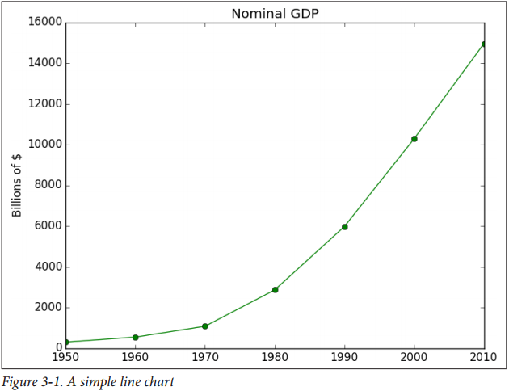
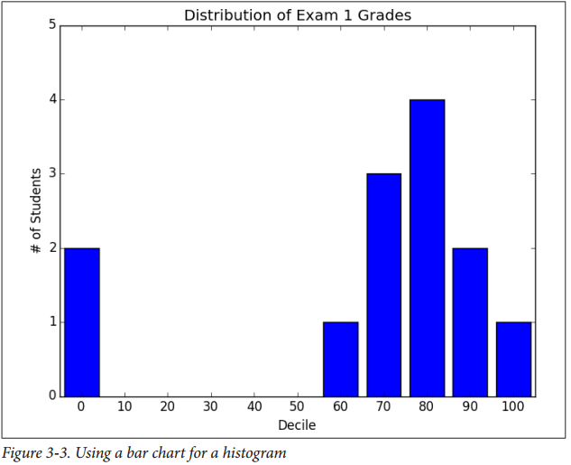
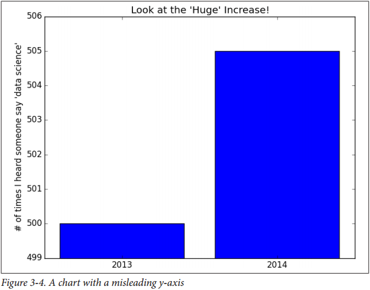
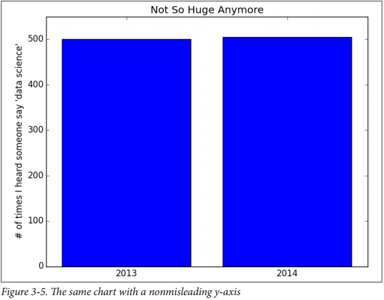
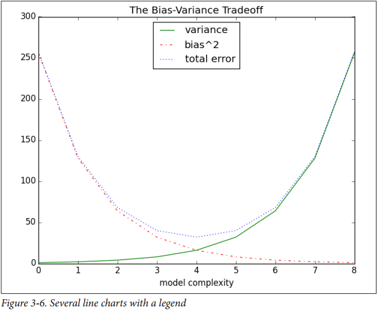
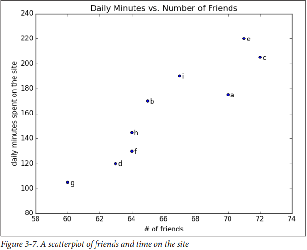
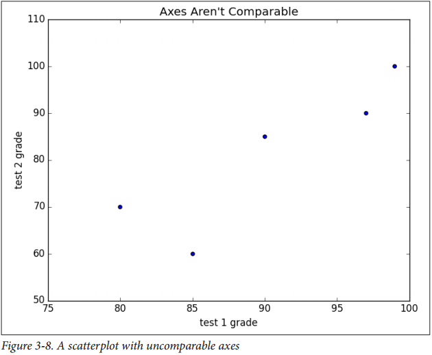
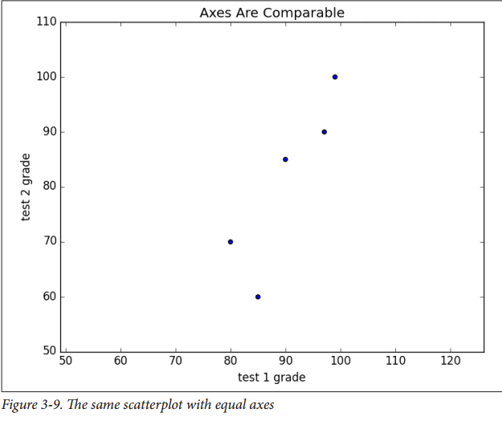

# Chapter 3 数据可视化

> 我坚信可视化是实现个人目标最强大的工具之一

> —— Harvey Mackay

数据科学家工具集的一个基本组成部分是数据可视化。尽管非常容易创建可视化，但要做好却不容易。

数据可视化主要有两个用途：
* 研究数据
* 传递数据信息

本章，我们集中处理建立 你研究数据所需要的技能以及在本书余下章节中所要生成的可视化，正如其他的一些章节，数据可视化内容丰富得足以单独写一本书。然而，我们试试让你理解怎样才是好的可视化，什么不是

## matplotlib
在数据可视化领域有很多工具。我们也使用广泛使用的 [matplotlib library](http://matplotlib.org)。如果你对生成可交互的Web可视化，这个选择并不好，但对于简单的条形图，折线图和散点图，它绰绰有余。

具体来说，我们将使用`matplotlib.pyplot`模块。 在其中最简单的应用， `pyplot`， 一旦完成，你可以保存（通过`savefig()`）或显示(通过`show()`）

例如，绘制一个简单的图表
```python
from matplotlib import pyplot as plt

years = [1950, 1960, 1970, 1980, 1990, 2000, 2010]
gdp = [300.2, 543.3, 1075.9, 2862.5, 5979.6, 10289.7, 14958.3]

# create a line chart, years on x-axis, gdp on y-axis
plt.plot(years, gdp, color='green', marker='o', linestyle='solid')

# add a title
plt.title("Nominal GDP")

# add a label to the y-axis
plt.ylabel("Billions of $")
plt.show()
```



怎样让图片显示得更好比较复杂且不在本章的讨论范围之内。有许多方式来自定义图表，比如坐标文本，线条样式，点标记，与其花时间到这些，我们仅仅使用其中一些到我们的案例中。

>插图 尽管我们不会使用太多功能，`matplotlib`能够生成很复杂的图表， 可交互的，如果你想了解更多查阅其相关文档。


## 条形图
用条形图是很很好的选择，图3-2展示了每个不同的电影赢得了几次奥斯卡金像奖
```python
from matplotlib import pyplot as plt

movies = ["Annie Hall", "Ben-Hur", "Casablanca", "Gandhi", "West Side Story"]
num_oscars = [5, 11, 3, 8, 10]

# bars are by default with 0.8, so we'll add 0.1 to the left corrdinates
# so that each bar is centered
xs = [i + 0.1 for i, _ in enumerate(movies)]

# plot bars with left x-coordinates [xs], heights [num_oscars]
plt.bar(xs, num_oscars)

plt.ylabel("# of Academy Awards")
plt.title("My Favorite Movies")

# label x-axis with movie names at bar centers
plt.xticks([i + 0.5 for i, _ in enumerate(movies)], movies)

plt.show()
```
条形图也可以用来绘制不同时段的数值的直方图， 用于可视化研究数值是如何分布的，如图3-3
```python
from matplotlib import pyplot as plt
from collections import Counter

grades = [83, 95, 91,87, 70, 0, 85, 82, 100, 67, 73, 0]
decile = lambda grade: grade // 10 * 10
histogram = Counter(decile(grade) for grade in grades)

plt.bar([x - 4 for x in histogram.keys()],  # shift each bar to the left by 4
        histogram.values(),                 # give each bar its correct height
        8)                                  # give each bar a width of 8

plt.axis([-5, 105, 0, 5])                   # x-axis from -5 to 105
                                            # y-axis from 0 to 5

plt.xticks([10 * i for i in range(11)])     # x-axis labels at 0, 10, ..., 100
plt.xlabel("Decile")
plt.ylabel("# of Students")
plt.title("Distribution of Exam 1 Grades")
plt.show()

```


`plt.bar`的第三个参数指定了条的宽度，本例中我们指定宽度为8（这让条和条之间的缝隙很小，）And we
shifted the bar left by 4, so that (for example) the “80” bar has its left and right sides at
76 and 84, and (hence) its center at 80.

The call to plt.axis indicates that we want the x-axis to range from -5 to 105 (so that
the “0” and “100” bars are fully shown), and that the y-axis should range from 0 to 5.
And the call to plt.xticks puts x-axis labels at 0, 10, 20, …, 100.

Be judicious when using plt.axis(). When creating bar charts it is considered espe‐
cially bad form for your y-axis not to start at 0, since this is an easy way to mislead
people (Figure 3-4):

```python
from matplotlib import pyplot as plt

mentions = [500, 505]
years = [2013, 2014]

plt.bar([2012.6, 2013.6], mentions, 0.8)
plt.xticks(years)
plt.ylabel("# of times I heard someone say 'data science'")

# if you don't do this, matplotlib will label the x-axis 0, 1
# and then add a +2.013e3 off in the corner (bad matplotlib!)
plt.ticklabel_format(useOffset=False)

# misleading y-axis only shows the part above 500
plt.axis([2012.5, 2014.5, 499, 506])
plt.title("Look at the 'Huge' Increase!")
plt.show()
```


在图3-5中，我们使用了更多的
In Figure 3-5, we use more-sensible axes, and it looks far less impressive:
```python
from matplotlib import pyplot as plt

mentions = [500, 505]
years = [2013, 2014]

plt.bar([2012.6, 2013.6], mentions, 0.8)
plt.xticks(years)
plt.ylabel("# of times I heard someone say 'data science'")

# if you don't do this, matplotlib will label the x-axis 0, 1
# and then add a +2.013e3 off in the corner (bad matplotlib!)
plt.ticklabel_format(useOffset=False)

# misleading y-axis only shows the part above 500
# plt.axis([2012.5, 2014.5, 499, 506])
# plt.title("Look at the 'Huge' Increase!")
# plt.show()

plt.axis([2012.5,2014.5,0,550])
plt.title("Not So Huge Anymore")
plt.show()
```



## 折线图
正如我们所见到的，我们可以使用`plt.plot()`来绘制折线图。他它们用来表示趋势很合适，如下图所示
```python
from matplotlib import pyplot as plt

variance = [1, 2, 4, 8, 16, 32, 64, 128, 256]
bias_squared = [256, 128, 64, 32, 16, 8, 4, 2, 1]
total_error = [x + y for x, y in zip(variance, bias_squared)]
xs = [ i for i, _ in enumerate(variance)]

# we can make multiple calls to plt.plot
# to show multiple series on the same chart
plt.plot(xs, variance,      'g-',   label='variance')   # green solid line
plt.plot(xs, bias_squared,  'r-.',  label='bias^2')     # red dot-dashed line
plt.plot(xs, total_error,   'b:',   label='total error')# blue dotted line

# because we've assigned labels to each series
# we can get a legend for free
# loc=9 means "top center"
plt.legend(loc=9)
plt.xlabel("model complexity")
plt.title("The Bias-Variance Tradeoff")
plt.show()
```




## 散点图
A scatterplot is the right choice for visualizing the relationship between two paired
sets of data. For example, Figure 3-7 illustrates the relationship between the number
of friends your users have and the number of minutes they spend on the site every
day:

```python
from matplotlib import pyplot as plt

friends = [ 70, 65, 72, 63, 71, 64, 60, 64, 67]
minutes = [175, 170, 205, 120, 220, 130, 105, 145, 190]
labels = ['a', 'b', 'c', 'd', 'e', 'f', 'g', 'h', 'i']
plt.scatter(friends, minutes)

# label each point
for label, friend_count, minute_count in zip(labels, friends, minutes):
    plt.annotate(label,
                 xy=(friend_count, minute_count),   # put the label with its point
                 xytext=(5, -5),                    # but slightly offset
                 textcoords='offset points')

plt.title("Daily Minutes vs. Number of Friends")
plt.xlabel("# of friends")
plt.ylabel("daily minutes spent on the site")
plt.show()
```


If you’re scattering comparable variables, you might get a misleading picture if you let
matplotlib choose the scale, as in Figure 3-8:

```python
from matplotlib import pyplot as plt

test_1_grades = [ 99, 90, 85, 97, 80]
test_2_grades = [100, 85, 60, 90, 70]
plt.scatter(test_1_grades, test_2_grades)
plt.title("Axes Aren't Comparable")
plt.xlabel("test 1 grade")
plt.ylabel("test 2 grade")
plt.show()
```



If we include a call to plt.axis("equal"), the plot (Figure 3-9) more accurately
shows that most of the variation occurs on test 2.
That’s enough to get you started doing visualization. We’ll learn much more about
visualization throughout the book.




## 进一步探索

* [seaborn](http://stanford.io) 基于matplotlib，可以用来更加简单的生成更漂亮（也更复杂）的可视化文件。

* [D3.js](http://d3js.org) 是个Javascript库，它可以生成用于Web应用上的复杂的可交互的可视化。虽然不是Python，但它比较新潮且广泛使用，很值得你去熟悉了解。

• [Bokeh](http://bokeh.pydata.org) is a newer library that brings D3-style visualizations into Python. 是款可以用Python生成3D风格的可视化的新库。

• [ggplot](http://bit.ly) is a Python port of the popular R library ggplot2, which is widely used for
creating “publication quality” charts and graphics. It’s probably most interesting
if you’re already an avid ggplot2 user, and possibly a little opaque if you’re not.
