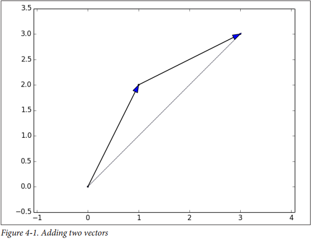
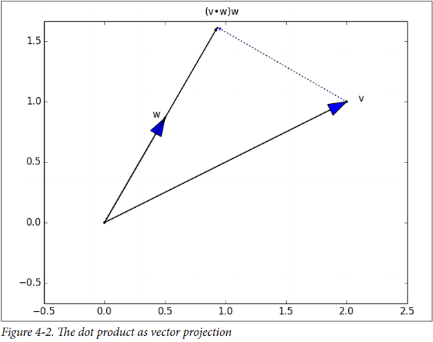
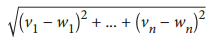

# Chapter4 线性代数

> 还是有什么比代数更加没用或用处不大的么？
>
> —— Billy Connolly

Linear algebra is the branch of mathematics that deals with vector spaces. Although I
can’t hope to teach you linear algebra in a brief chapter, it underpins a large number
of data science concepts and techniques, which means I owe it to you to at least try.
What we learn in this chapter we’ll use heavily throughout the rest of the book.

线性代数是数学中用来处理向量空间的分支。尽管我不指望在这简单的章节里教你线性代数，

我们在本章所学到得内容在本书接下来的部分会用到很多。

## 向量
Abstractly, vectors are objects that can be added together (to form new vectors) and
that can be multiplied by scalars (i.e., numbers), also to form new vectors.
Concretely (for us), vectors are points in some finite-dimensional space. Although
you might not think of your data as vectors, they are a good way to represent numeric
data.
For example, if you have the heights, weights, and ages of a large number of people,
you can treat your data as three-dimensional vectors (height, weight, age). If
you’re teaching a class with four exams, you can treat student grades as four
dimensional vectors (exam1, exam2, exam3, exam4).
The simplest from-scratch approach is to represent vectors as lists of numbers. A list
of three numbers corresponds to a vector in three-dimensional space, and vice versa:

抽象来说， 向量是可以通过相加得到新的向量的对象，也可以通过乘以标量（比如数字）

具体来说，向量是有限维度空间的点。尽管你可能不把你的数据作为向量，但它们是很好的方式来表示数值型数据

举例来说，你有许多人得身高，体重和年龄，你可以把你的数据看做三维向量（身高，体重，年龄）。如果你是教4门课的老师，你可以将学生的分数作为四维向量(成绩1，成绩2，成绩3，成绩4）

开始将向量用数值列表。一个含有3个数的列表对应一个三维空间的向量，反之亦然：

```python
height_weight_age=[70,  # inches,
                   170, # pounds,
                   40]  # years

grades = [95, # exam1
          88, # exam2
          75, # exam3
          62] # exam4
```

One problem with this approach is that we will want to perform arithmetic on vectors. Because Python lists aren’t vectors (and hence provide no facilities for vector arithmetic), we’ll need to build these arithmetic tools ourselves. So let’s start with that.
To begin with, we’ll frequently need to add two vectors. Vectors add componentwise.
This means that if two vectors v and w are the same length, their sum is just the vector
whose first element is v[0] + w[0], whose second element is v[1] + w[1], and so
on. (If they’re not the same length, then we’re not allowed to add them.)
For example, adding the vectors [1, 2] and [2, 1] results in [1 + 2, 2 + 1] or [3,
3], as shown in Figure 4-1.

是用该方式需要面临一个问题就是需要处理向量的运算。由于Python的列表并非向量，我们需要自己实现这些算法，我们就从这里开始吧。

从哪里开始呢？我们会频繁使用向量相加。
它的意思是，如果两个向量v和w长度相同，他们相加的结果也就是它们的第一个元素与第一个元素相加，第二个元素和第二个元素相加，如果它们的元素个数不等，则不允许相加

举例来说，[1,2] [2,1]相加的结果为[1 + 2, 2 + 1],或者[3, 3]如下图所示



我们可以通过Zip两个向量或者使用list 来相加对应的元素：
We can easily implement this by zip-ing the vectors together and using a list compre‐
hension to add the corresponding elements:

```python
def vector_add(v, w):
    """adds corresponding elements"""
    return [v_i + w_i
            for v_i, w_i in zip(v, w)]
```
Similarly, to subtract two vectors we just subtract corresponding elements:
与之相似，两个向量相减
```python
def vector_subtract(v, w):
    """subtracts corresponding elements"""
    return [v_i - w_i
            for v_i, w_i in zip(v,w)]
            
```
We’ll also sometimes want to componentwise sum a list of vectors. That is, create a
new vector whose first element is the sum of all the first elements, whose second element is the sum of all the second elements, and so on. The easiest way to do this is by
adding one vector at a time:

```python
def vector_sum(vectors):
    """sums all corresponding elements"""
    result = vectors[0]                     # start with the first vector
    for vector in vectors[1:]:              # then loop over the others
        result = vector_add(result, vector) # and add them to the result
    return result
```
If you think about it, we are just reduce-ing the list of vectors using vector_add,
which means we can rewrite this more briefly using higher-order functions:
```python
def vector_sum(vectors):
    return reduce(vector_add, vectors)
```
or even:
```python
vector_sum = partial(reduce, vector_add)
```
although this last one is probably more clever than helpful.
We’ll also need to be able to multiply a vector by a scalar, which we do simply by multiplying each element of the vector by that number:

```python
def scalar_multiply(c, v):
    """c is a number, v is a vector"""
    return [c * v_i for v_i in v]

```

This allows us to compute the componentwise means of a list of (same-sized) vectors:
```python
def vector_mean(vectors):
    """ compute the vector whose ith element is the mean of the
    ith elements of the input vectors"""
    n = len(vectors)
    return scalar_multiply(1/n, vector_sum(vectors))
```
A less obvious tool is the dot product. The dot product of two vectors is the sum of
their componentwise products:
```python
def dot(v, w):
    """v_1 * w_1 + ... + v_n * w_n"""
    return sum(v_i * w_i
               for v_i, w_i in zip(v,w))
```
The dot product measures how far the vector v extends in the w direction. For exam‐
ple, if w = [1, 0] then dot(v, w) is just the first component of v. Another way of
saying this is that it’s the length of the vector you’d get if you projected v onto w
(Figure 4-2).



Using this, it’s easy to compute a vector’s sum of squares:
```python
def sum_of_squares(v):
"""v_1 * v_1 + ... + v_n * v_n"""
return dot(v, v)
```
Which we can use to compute its magnitude (or length):
```python
import math
def magnitude(v):
    return math.sqrt(sum_of_squares(v)) # math.sqrt is square root function
```
We now have all the pieces we need to compute the distance between two vectors,
defined as:



```python
def squared_distance(v, w):
"""(v_1 - w_1) ** 2 + ... + (v_n - w_n) ** 2"""
    return sum_of_squares(vector_subtract(v, w))

def distance(v, w):
    return math.sqrt(squared_distance(v, w))
```

Which is possibly clearer if we write it as (the equivalent):

```python
def distance(v, w):
    return magnitude(vector_subtract(v, w))
```
That should be plenty to get us started. We’ll be using these functions heavily
throughout the book.

>Using lists as vectors is great for exposition but terrible for perfor‐
mance.
In production code, you would want to use the NumPy library,
which includes a high-performance array class with all sorts of
arithmetic operations included.


## 矩阵
A matrix is a two-dimensional collection of numbers. We will represent matrices as
lists of lists, with each inner list having the same size and representing a row of the
matrix. If A is a matrix, then A[i][j] is the element in the ith row and the jth column.
Per mathematical convention, we will typically use capital letters to represent matri‐
ces. For example:

```python
A = [[1, 2, 3], # A has 2 rows and 3 columns
    [4, 5, 6]]
    
B = [[1, 2], # B has 3 rows and 2 columns
    [3, 4],
    [5, 6]]
```

> In mathematics, you would usually name the first row of the matrix
“row 1” and the first column “column 1.” Because we’re represent‐
ing matrices with Python lists, which are zero-indexed, we’ll call
the first row of a matrix “row 0” and the first column “column 0.”

Given this list-of-lists representation, the matrix A has len(A) rows and len(A[0])
columns, which we consider its shape:

```python
def shape(A):
    num_rows = len(A)
    num_cols = len(A[0]) if A else 0 # number of elements in first row
    return num_rows, num_cols
```

If a matrix has n rows and k columns, we will refer to it as a n × k matrix. We can
(and sometimes will) think of each row of a n × k matrix as a vector of length k, and
each column as a vector of length n:

```python
def get_row(A, i):
    return A[i] # A[i] is already the ith row
    
def get_column(A, j):
    return [A_i[j]      # jth element of row A_i
        for A_i in A]   # for each row A_i
```

We’ll also want to be able to create a matrix given its shape and a function for generat‐
ing its elements. We can do this using a nested list comprehension:
```python
def make_matrix(num_rows, num_cols, entry_fn):
    """returns a num_rows x num_cols matrix
    whose (i,j)th entry is entry_fn(i, j)"""
    return [[entry_fn(i, j) # given i, create a list
        for j in range(num_cols)] # [entry_fn(i, 0), ... ]
        for i in range(num_rows)] # create one list for each i
```
Given this function, you could make a 5 × 5 identity matrix (with 1s on the diagonal
and 0s elsewhere) with:
```python
def is_diagonal(i, j):
"""1's on the 'diagonal', 0's everywhere else"""
return 1 if i == j else 0
identity_matrix = make_matrix(5, 5, is_diagonal)
# [[1, 0, 0, 0, 0],
# [0, 1, 0, 0, 0],
# [0, 0, 1, 0, 0],
# [0, 0, 0, 1, 0],
# [0, 0, 0, 0, 1]]
```

Matrices will be important to us for several reasons.
First, we can use a matrix to represent a data set consisting of multiple vectors, simply
by considering each vector as a row of the matrix. For example, if you had the
heights, weights, and ages of 1,000 people you could put them in a 1, 000 × 3 matrix:

```python
data = [[70, 170, 40],
[65, 120, 26],
[77, 250, 19],
# ....
]
```
Second, as we’ll see later, we can use an n × k matrix to represent a linear function
that maps k-dimensional vectors to n-dimensional vectors. Several of our techniques
and concepts will involve such functions.

Third, matrices can be used to represent binary relationships. In Chapter 1, we repre‐
sented the edges of a network as a collection of pairs (i, j). An alternative represen‐
tation would be to create a matrix A such that A[i][j] is 1 if nodes i and j are
connected and 0 otherwise.
Recall that before we had:

```python
friendships = [(0, 1), (0, 2), (1, 2), (1, 3), (2, 3), (3, 4),
(4, 5), (5, 6), (5, 7), (6, 8), (7, 8), (8, 9)]
```
We could also represent this as:
```python
# user 0 1 2 3 4 5 6 7 8 9
#
friendships = [[0, 1, 1, 0, 0, 0, 0, 0, 0, 0], # user 0
[1, 0, 1, 1, 0, 0, 0, 0, 0, 0], # user 1
[1, 1, 0, 1, 0, 0, 0, 0, 0, 0], # user 2
[0, 1, 1, 0, 1, 0, 0, 0, 0, 0], # user 3
[0, 0, 0, 1, 0, 1, 0, 0, 0, 0], # user 4
[0, 0, 0, 0, 1, 0, 1, 1, 0, 0], # user 5
[0, 0, 0, 0, 0, 1, 0, 0, 1, 0], # user 6
[0, 0, 0, 0, 0, 1, 0, 0, 1, 0], # user 7
[0, 0, 0, 0, 0, 0, 1, 1, 0, 1], # user 8
[0, 0, 0, 0, 0, 0, 0, 0, 1, 0]] # user 9
```
If there are very few connections, this is a much more inefficient representation, since
you end up having to store a lot of zeroes. However, with the matrix representation it
is much quicker to check whether two nodes are connected—you just have to do a
matrix lookup instead of (potentially) inspecting every edge:
```python
friendships[0][2] == 1 # True, 0 and 2 are friends
friendships[0][8] == 1 # False, 0 and 8 are not friends
```
Similarly, to find the connections a node has, you only need to inspect the column (or
the row) corresponding to that node:
```python
friends_of_five = [i # only need
    for i, is_friend in enumerate(friendships[5]) # to look at
    if is_friend] # one row
```
Previously we added a list of connections to each node object to speed up this pro‐
cess, but for a large, evolving graph that would probably be too expensive and diffi‐
cult to maintain.
We’ll revisit matrices throughout the book.

## For Further Exploration
* Linear algebra is widely used by data scientists (frequently implicitly, and not
infrequently by people who don’t understand it). It wouldn’t be a bad idea to read
a textbook. You can find several freely available online:

    — Linear Algebra, from UC Davis
    
    — Linear Algebra, from Saint Michael’s College
    
    — If you are feeling adventurous, Linear Algebra Done Wrong is a more advanced introduction
* All of the machinery we built here you get for free if you use NumPy. (You get a
lot more too.)
