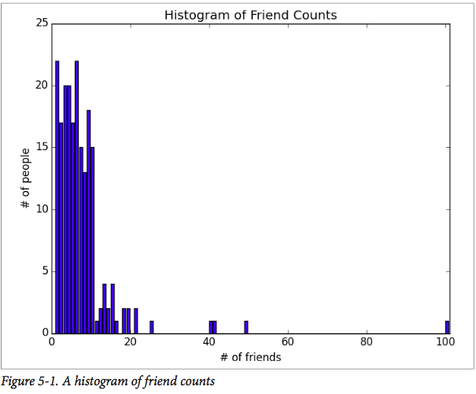

# Chapter 5 统计

> Facts are stubborn, but statistics are more pliable.

> Mark Twain

Statistics refers to the mathematics and techniques with which we understand data. It is a rich, enormous field, more suited to a shelf (or room) in a library rather than a chapter in a book, and so our discussion will necessarily not be a deep one. Instead, I’ll try to teach you just enough to be dangerous, and pique your interest just enough that you’ll go off and learn more.

统计是指帮助我们理解数据的数学和技术。关于其丰富广阔的内容更像需要图书馆的一个书架或房间来呈现，因此在本章的讨论内容不会深入。取而代之，我所教你的内容？！足够你感兴趣

## 描述单个数据集合

Through a combination of word-of-mouth and luck, DataSciencester has grown to dozens of members, and the VP of Fundraising asks you for some sort of description of how many friends your members have that he can include in his elevator pitches.

进过口碑和运气， 数据科学家已经发展到几十个成员，筹款的副总裁问你

Using techniques from Chapter 1, you are easily able to produce this data. But now you are faced with the problem of how to describe it.
One obvious description of any data set is simply the data itself:

使用第一章提到的技能，你可以很简单的生成数据，但你会遇到如何描述它的问题。任何数据集的描述是对数据进行简化

```python
num_friends = [100, 49, 41, 40, 25,
               # ... and lots more
               ]
```
For a small enough data set this might even be the best description. But for a larger data set, this is unwieldy and probably opaque. (Imagine staring at a list of 1 million numbers.) For that reason we use statistics to distill and communicate relevant features of our data.
As a first approach you put the friend counts into a histogram using Counter and plt.bar() (Figure 5-1):

对于小块数据集用以上的方式是很好的描述方式。但对于大一些的数据，这就有些不实用且恐怕有些不透明？！（想象一下一个列表里有上百万的数值）出于那样的情况，我们使用统计来提取和表示数据的相关特性，第一个方法
如图 5-1 所示：



```python
friend_counts = Counter(num_friends) 
xs = range(101)                         # largest value is 100
ys = [friend_counts[x] for x in xs]     # height is just # of friends
plt.bar(xs, ys)
plt.axis([0, 101, 0, 25])
plt.title("Histogram of Friend Counts")
plt.xlabel("# of friends")
plt.ylabel("# of people")
plt.show()
```

Unfortunately, this chart is still too difficult to slip into conversations. So you start generating some statistics. Probably the simplest statistic is simply the number of data points:

不幸的是，图表也不能很好的说明问题，于是你开始生成统计信息。也许最简单的统计信息是数据量？

```python
num_points = len(num_friends) # 204
```

You’re probably also interested in the largest and smallest values:
你也许对一组数据里的最大值和最小值感兴趣

```python
largest_value = max(num_friends) # 100 
smallest_value = min(num_friends) # 1
```

which are just special cases of wanting to know the values in specific positions:
在某些情况下需要知道特殊位置的特殊值

```python
sorted_values = sorted(num_friends)
    smallest_value = sorted_values[0]           # 1
    second_smallest_value = sorted_values[1]    # 1
    second_largest_value = sorted_values[-2]    # 49
```
But we’re only getting started.
但这仅仅是开始。

### Central Tendencies 集中趋势 中值计算
Usually, we’ll want some notion of where our data is centered. Most commonly we’ll use the mean (or average), which is just the sum of the data divided by its count:

通常来说，我们想知道数据集中在哪个，一半我们用平均值（或平均数），也就是所有数值的总和再除以数值的个数

```python
 # 如果不在顶部添加 from __future__ import division会报错
def mean(x):
    return sum(x) / len(x)
    mean(num_friends) # 7.333333
```

If you have two data points, the mean is simply the point halfway between them. As you add more points, the mean shifts around, but it always depends on the value of every point.

如果有两个数据点，平均数就是它们中间的点。当添加更多的点时，平均数点会位移，但总是和所有点得值相关。

We’ll also sometimes be interested in the median, which is the middle-most value (if the number of data points is odd) or the average of the two middle-most values (if the number of data points is even).

我们有时还对中位数感兴趣，也就是最中间的那个值（如果数据的总量是奇数的话）或者中间两个数的平均值（如果数据的总量是偶数）。

For instance, if we have five data points in a sorted vector x, the median is x[5 // 2] or x[2]. If we have six data points, we want the average of x[2] (the third point) and x[3] (the fourth point).

举例来说， 如果在一个有序向量X中有5个值，中位数就是x[5 //2]或者 x[2]. 如果有六个值，我们会取x[2](第三个点) 和 x[3](第4个点)的平均值。

Notice that—unlike the mean—the median doesn’t depend on every value in your data. For example, if you make the largest point larger (or the smallest point smaller), the middle points remain unchanged, which means so does the median.

注意中位数不像平均数，它不依赖于数据中的所有值，例如，让更大的数据点更大（或更小的数据点更小），中间的点不变，中位数也不变。

The median function is slightly more complicated than you might expect, mostly because of the “even” case:

由于数据点总数会出现偶数的情况，求中位数的函数可能比你预期的稍微复杂些：


```python
def median(v):
    """finds the 'middle-most' value of v""" n = len(v)
    sorted_v = sorted(v)
    midpoint = n // 2
    if n % 2 == 1:
        # if odd, return the middle value 
        return sorted_v[midpoint]
    else:
        # if even, return the average of the middle values 
        lo = midpoint - 1
        hi = midpoint
        return (sorted_v[lo] + sorted_v[hi]) / 2
median(num_friends) # 6.0
```

Clearly, the mean is simpler to compute, and it varies smoothly as our data changes. If we have n data points and one of them increases by some small amount e, then necessarily the mean will increase by e / n. (This makes the mean amenable to all sorts of calculus tricks.) Whereas in order to find the median, we have to sort our data. And changing one of our data points by a small amount e might increase the median by e, by some number less than e, or not at all (depending on the rest of the data).

显而易见的，求平均数比较易于计算，且当我们的数据变化时它也能平缓的改变。 如果我们有n个数据点，其中一个点增加了e，那么平均数增加了 e/n， 这使得求平均数运算经得起各种计算，相比于求中位数，我们必须对数据进行排序。

> There are, in fact, nonobvious tricks to efficiently compute medians without sorting the data. However, they are beyond the scope of this book, so we have to sort the data.

> 事实上是有高效的技巧，不需要排序就能获取中间数的。然而，不在本书的讨论范围之内，因此我们必须排序。

At the same time, the mean is very sensitive to outliers in our data. If our friendliest user had 200 friends (instead of 100), then the mean would rise to 7.82, while the median would stay the same. If outliers are likely to be bad data (or otherwise unrepresentative of whatever phenomenon we’re trying to understand), then the mean can sometimes give us a misleading picture. For example, the story is often told that in the mid-1980s, the major at the University of North Carolina with the highest average starting salary was geography, mostly on account of NBA star (and outlier) Michael Jordan.

与此同时，取平均数对数据中的异常值是非常敏感的。假设我们最友好的用户有200（而不是100）个朋友，那么平均数将会上升7.82，但中位数还是一样。如果异常值正好是脏数据（或者不能表示我们想理解的情况），那么该平均数有时会误导我们。例如在1980年经常说的一个故事，北卡罗莱纳大学最高的 平均起薪是地理，主要是由于把NBA明星（异常值）迈克尔-乔丹算进去了。

A generalization of the median is the quantile, which represents the value less than which a certain percentile of the data lies. (The median represents the value less than which 50% of the data lies.)


中位数所推广的是位数，用于表示数值低于某个确定的。。

```python
def quantile(x, p):
    """returns the pth-percentile value in x""" 
    p_index = int(p * len(x))
    return sorted(x)[p_index]
quantile(num_friends, 0.10) # 1 
quantile(num_friends, 0.25) # 3 
quantile(num_friends, 0.75) # 9 
quantile(num_friends, 0.90) # 13
```

Less commonly you might want to look at the mode, or most-common value[s]:

比较少见的是你可能需要求取众数，

```python
def mode(x):
    """returns a list, might be more than one mode""" 
    counts = Counter(x)
    max_count = max(counts.values())
    return [x_i for x_i, count in counts.iteritems()
        if count == max_count] 

mode(num_friends) # 1 and 6
```

But most frequently we’ll just use the mean.
但绝大数情况下我们只使用求平均值。

###  离散
Dispersion refers to measures of how spread out our data is. Typically they’re statistics for which values near zero signify not spread out at all and for which large values (whatever that means) signify very spread out. For instance, a very simple measure is the range, which is just the difference between the largest and smallest elements:
离散是用来测量我们的数据如何分布的

例如，最简单的测量就是范围，也就是最大值和最小值之间的距离


```python
# "range" already means something in Python, so we'll use a different name
def data_range(x):
    return max(x) - min(x)
data_range(num_friends) # 99
```


The range is zero precisely when the max and min are equal, which can only happen if the elements of x are all the same, which means the data is as undispersed as possible. Conversely, if the range is large, then the max is much larger than the min and the data is more spread out.

当最大值和最小值相等时距离为0，这种情况仅仅在x中所有元素都相同的情况下发生，也就意味着该数据没有离散。对应的，如果距离非常大，那么最大值比最小值大很多，数据更加分散。

Like the median, the range doesn’t really depend on the whole data set. A data set whose points are all either 0 or 100 has the same range as a data set whose values are 0, 100, and lots of 50s. But it seems like the first data set “should” be more spread out.

正如众数，距离几乎不依赖于整个数据集。一个数据集里的所有点全是0或100，那么

A more complex measure of dispersion is the variance, which is computed as:

更加复杂的离散测量方法是方差：


```python
def de_mean(x):
    """translate x by subtracting its mean (so the result has mean 0)""" 
    x_bar = mean(x)
    return [x_i - x_bar for x_i in x]
def variance(x):
    """assumes x has at least two elements"""
    n = len(x)
    deviations = de_mean(x)
    return sum_of_squares(deviations) / (n - 1)
    
variance(num_friends) # 81.54
```

> This looks like it is almost the average squared deviation from the mean, except that we’re dividing by n-1 instead of n. In fact, when we’re dealing with a sample from a larger population, x_bar is only an estimate of the actual mean, which means that on average (x_i - x_bar) ** 2 is an underestimate of x_i’s squared deviation from the mean, which is why we divide by n-1 instead of n. See Wikipe‐ dia.

Now, whatever units our data is in (e.g., “friends”), all of our measures of central tendency are in that same unit. The range will similarly be in that same unit. The var‐ iance, on the other hand, has units that are the square of the original units (e.g., “friends squared”). As it can be hard to make sense of these, we often look instead at the standard deviation:

```python
def standard_deviation(x):
    return math.sqrt(variance(x))
    
standard_deviation(num_friends) # 9.03
```
Both the range and the standard deviation have the same outlier problem that we saw earlier for the mean. Using the same example, if our friendliest user had instead 200 friends, the standard deviation would be 14.89, more than 60% higher!
A more robust alternative computes the difference between the 75th percentile value and the 25th percentile value:
```python

def interquartile_range(x):
return quantile(x, 0.75) - quantile(x, 0.25)
interquartile_range(num_friends) # 6
```
which is quite plainly unaffected by a small number of outliers.

## Correlation 相关性
DataSciencester’s VP of Growth has a theory that the amount of time people spend on the site is related to the number of friends they have on the site (she’s not a VP for nothing), and she’s asked you to verify this.
After digging through traffic logs, you’ve come up with a list daily_minutes that shows how many minutes per day each user spends on DataSciencester, and you’ve ordered it so that its elements correspond to the elements of our previous num_friends list. We’d like to investigate the relationship between these two metrics.
We’ll first look at covariance, the paired analogue of variance. Whereas variance measures how a single variable deviates from its mean, covariance（协方差） measures how two variables vary in tandem from their means:

```python

def covariance(x, y): 
    n = len(x)
    return dot(de_mean(x), de_mean(y)) / (n - 1) covariance(num_friends, daily_minutes) # 22.43
```
Recall that dot sums up the products of corresponding pairs of elements. When corresponding elements of x and y are either both above their means or both below their means, a positive number enters the sum. When one is above its mean and the other below, a negative number enters the sum. Accordingly, a “large” positive covariance means that x tends to be large when y is large and small when y is small. A “large” negative covariance means the opposite—that x tends to be small when y is large and vice versa. A covariance close to zero means that no such relationship exists.
Nonetheless, this number can be hard to interpret, for a couple of reasons:

* Its units are the product of the inputs’ units (e.g., friend-minutes-per-day), which can be hard to make sense of. (What’s a “friend-minute-per-day”?)
* If each user had twice as many friends (but the same number of minutes), the covariance would be twice as large. But in a sense the variables would be just as interrelated. Said differently, it’s hard to say what counts as a “large” covariance.

For this reason, it’s more common to look at the correlation, which divides out the standard deviations of both variables:

```python
def correlation(x, y):
    stdev_x = standard_deviation(x) 
    stdev_y = standard_deviation(y) 
    if stdev_x > 0 and stdev_y > 0:
        return covariance(x, y) / stdev_x / stdev_y 
    else:
        return 0 # if no variation, correlation is zero 
    
correlation(num_friends, daily_minutes) # 0.25
```
The correlation is unitless and always lies between -1 (perfect anti-correlation) and 1 (perfect correlation). A number like 0.25 represents a relatively weak positive corre‐ lation.
However, one thing we neglected to do was examine our data. Check out Figure 5-2.

Figure 5-2
The person with 100 friends (who spends only one minute per day on the site) is a huge outlier, and correlation can be very sensitive to outliers. What happens if we ignore him?

```python
outlier = num_friends.index(100) # index of outlier
num_friends_good = [x
                    for i, x in enumerate(num_friends)
                    if i != outlier]
                    
daily_minutes_good = [x
                    for i, x in enumerate(daily_minutes)
                    if i != outlier]
                    
correlation(num_friends_good, daily_minutes_good) # 0.57
```
Without the outlier, there is a much stronger correlation (Figure 5-3).
除去异常值，关联性更强

You investigate further and discover that the outlier was actually an internal test account that no one ever bothered to remove. So you feel pretty justified in excluding it.

你继续调查并发现那个异常值其实是一个内部测试账号


## Simpson's Paradox
One not uncommon surprise when analyzing data is Simpson’s Paradox, in which correlations can be misleading when confounding variables are ignored.
For example, imagine that you can identify all of your members as either East Coast data scientists or West Coast data scientists. You decide to examine which coast’s data scientists are friendlier:

pic

It certainly looks like the West Coast data scientists are friendlier than the East Coast data scientists. Your coworkers advance all sorts of theories as to why this might be: maybe it’s the sun, or the coffee, or the organic produce, or the laid-back Pacific vibe?
When playing with the data you discover something very strange. If you only look at people with PhDs, the East Coast data scientists have more friends on average. And if you only look at people without PhDs, the East Coast data scientists also have more friends on average!

pic

Once you account for the users’ degrees, the correlation goes in the opposite direc‐ tion! Bucketing the data as East Coast/West Coast disguised the fact that the East Coast data scientists skew much more heavily toward PhD types.
This phenomenon crops up in the real world with some regularity. The key issue is that correlation is measuring the relationship between your two variables all else being equal. If your data classes are assigned at random, as they might be in a well-designed experiment, “all else being equal” might not be a terrible assumption. But when there is a deeper pattern to class assignments, “all else being equal” can be an awful assump‐ tion.
The only real way to avoid this is by knowing your data and by doing what you can to make sure you’ve checked for possible confounding factors. Obviously, this is not always possible. If you didn’t have the educational attainment of these 200 data scien‐ tists, you might simply conclude that there was something inherently more sociable about the West Coast.

## 关联性的其他注意事项
A correlation of zero indicates that there is no linear relationship between the two variables. However, there may be other sorts of relationships. For example, if:
```python
x = [-2, -1, 0, 1, 2] 
y = [2, 1,0,1,2]
```
then x and y have zero correlation. But they certainly have a relationship—each element of y equals the absolute value of the corresponding element of x. What they don’t have is a relationship in which knowing how x_i compares to mean(x) gives us information about how y_i compares to mean(y). That is the sort of relationship that correlation looks for.
In addition, correlation tells you nothing about how large the relationship is. The variables:
```python
x = [-2, 1, 0, 1, 2]
y = [99.98, 99.99, 100, 100.01, 100.02]
```
are perfectly correlated, but (depending on what you’re measuring) it’s quite possible that this relationship isn’t all that interesting.

## Correlation and Causation 关联性与因果关系
You have probably heard at some point that “correlation is not causation,” most likely by someone looking at data that posed a challenge to parts of his worldview that he was reluctant to question. Nonetheless, this is an important point—if x and y are strongly correlated, that might mean that x causes y, that y causes x, that each causes the other, that some third factor causes both, or it might mean nothing.

Consider the relationship between num_friends and daily_minutes. It’s possible that having more friends on the site causes DataSciencester users to spend more time on the site. This might be the case if each friend posts a certain amount of content each day, which means that the more friends you have, the more time it takes to stay current with their updates.

However, it’s also possible that the more time you spend arguing in the DataSciencester forums, the more you encounter and befriend like-minded people. That is, spending more time on the site causes users to have more friends.

A third possibility is that the users who are most passionate about data science spend more time on the site (because they find it more interesting) and more actively collect data science friends (because they don’t want to associate with anyone else).

One way to feel more confident about causality is by conducting randomized trials. If you can randomly split your users into two groups with similar demographics and give one of the groups a slightly different experience, then you can often feel pretty good that the different experiences are causing the different outcomes.

For instance, if you don’t mind being angrily accused of [experimenting on your users](http://www.nytimes.com/2014/06/30/technology/facebook-tinkers-with-users-emotions-in-news-feed-experiment-stirring-outcry.html?_r=1), you could randomly choose a subset of your users and show them content from only a fraction of their friends. If this subset subsequently spent less time on the site, this would give you some confidence that having more friends causes more time on the site.

## For Further Exploration
* [SciPy](http://docs.scipy.org/doc/scipy/reference/stats.html), [pandas](http://pandas.pydata.org), and [StatsModels](http://statsmodels.sourceforge.net) all come with a wide variety of statistical func‐ tions.

* Statistics is important. (Or maybe statistics are important?) If you want to be a good data scientist it would be a good idea to read a statistics textbook. Many are freely available online. A couple that I like are:
— [OpenIntro Statistics](https://www.openintro.org/stat/textbook.php)
— [OpenStax Introductory Statistics](https://www.openstaxcollege.org/textbooks/introductory-statistics)

